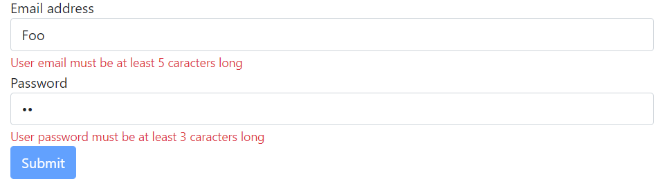
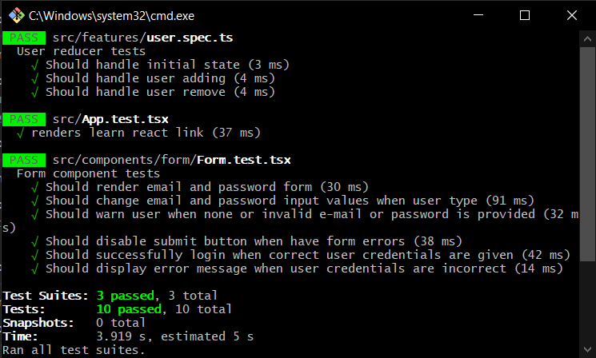

# React Testes

Este projeto está sendo feito para eu poder realizar um treino de algo que é uma fraqueza minha atualmente: **Testes**.
Escolhi usar um projeto com Redux e typescript, pois acredito que são tecnologias que incentivam ainda mais a criação de uma aplicação mais segura, concisa e de fácil manutenção.

## Aplicação
O aplicativo é extremamente simples, uma única página, com apenas um formulário, nada mais.

A única e exclusiva missão desse projeto foi essa:

Essa foi um pequeno teste de testes (haha), para eu poder me familizarizar com testes de unidade e conseguir aplicá-los em algo mais parecido com uma aplicação real.
